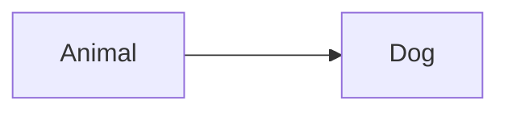

# 1.Inheritance
## 👉 Definition:
- Inheritance is a mechanism in Java where one class acquires (inherits) the properties (fields) and behaviors (methods) of another class using the extends keyword.

## 👉 Purpose:
- It promotes code reuse.

## 👉 Key points:

- Achieved using extends (for classes) or implements (for interfaces).
- It’s about reusing code and sharing implementation.
- A subclass inherits all accessible members (non-private fields, methods) from its superclass.

## Example
```java
class Animal {
    void eat() {
        System.out.println("Animal eats");
    }
}

class Dog extends Animal {     // Inheritance
    void bark() {
        System.out.println("Dog barks");
    }
}

public class Main {
    public static void main(String[] args) {
        Dog d = new Dog();
        d.eat();   // inherited from Animal
        d.bark();  // defined in Dog
    }
}

```

# 2.Subtyping

## 👉 Definition:
- Subtyping refers to the relationship where one type (class or interface) can be used in place of another.
- A subtype must obey the “is-a” relationship with its supertype.

## 👉 Purpose:
- It enables polymorphism — allowing an object of a subclass to be treated as an object of its superclass.

## 👉 Key points:
- All subclasses are subtypes of their superclass.
- All classes that implement an interface are subtypes of that interface.
- Subtyping is more about type compatibility than code sharing.

## Example 1
```java
class Animal {
    void makeSound() {
        System.out.println("Animal sound");
    }
}

class Cat extends Animal {   // Subtype of Animal
    void makeSound() {
        System.out.println("Meow");
    }
}

public class Main {
    public static void main(String[] args) {
        Animal a = new Cat();   // Subtyping in action
        a.makeSound();          // "Meow" (runtime polymorphism)
    }
}
```

> Animal is Supertype

> Dog is Subtype
---
## Example 2 : Interface-based Subtyping
```java
interface Shape {
    double area();
}

class Circle implements Shape {     // Circle is a subtype of Shape
    double radius;

    Circle(double r) {
        radius = r;
    }

    public double area() {
        return Math.PI * radius * radius;
    }
}

class Rectangle implements Shape {  // Rectangle is also a subtype of Shape
    double width, height;

    Rectangle(double w, double h) {
        width = w;
        height = h;
    }

    public double area() {
        return width * height;
    }
}

public class Main {
    public static void main(String[] args) {
        Shape s1 = new Circle(5);      // Circle used as Shape
        Shape s2 = new Rectangle(4, 6); // Rectangle used as Shape

        System.out.println(s1.area());  // works!
        System.out.println(s2.area());  // works!
    }
}
```
--- 
## Example 3 : Class Hierarchy Subtyping
```java
class Vehicle {
    void start() {
        System.out.println("Vehicle starts");
    }
}

class Car extends Vehicle {
    void openTrunk() {
        System.out.println("Trunk opened");
    }
}

class Bike extends Vehicle {
    void kickStart() {
        System.out.println("Bike kick-started");
    }
}

public class Main {
    public static void main(String[] args) {
        Vehicle v1 = new Car();   // Car is a subtype of Vehicle
        Vehicle v2 = new Bike();  // Bike is also a subtype of Vehicle

        v1.start();   // valid
        v2.start();   // valid
    }
}
```


# 3.Key Differences
| Aspect           | Inheritance                                 | Subtyping                                                              |
| ---------------- | ------------------------------------------- | ---------------------------------------------------------------------- |
| **Focus**        | Code reuse (sharing implementation)         | Type compatibility (polymorphism)                                      |
| **How achieved** | `extends` (class), `implements` (interface) | Any class that can substitute another type (is-a relationship)         |
| **Purpose**      | To avoid code duplication                   | To allow objects of one type to be used as another                     |
| **Example**      | Dog inherits `eat()` from Animal            | Dog **is an** Animal, so it can be used wherever an Animal is expected |
